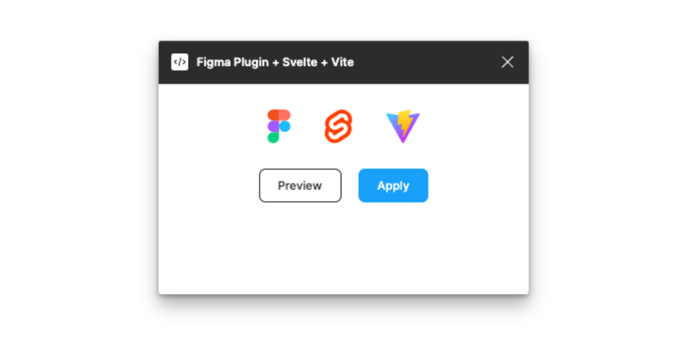

# Figma Plugin + Svelte + Vite + Typescript



A boilerplate for creating Figma plugins using Svelte, Vite and Typescript.

## Connecting your plugin to Figma

Connecting your plugin to Figma
After installing, go to **Plugins / Development / New Plugin** in the Figma desktop app for Mac OS or Windows and choose the option **"Link existing plugin"**.

_You also can just type "New Plugin" in Figma global search to go there_

From there you need to link a **manifest.json** file located at **public** folder in your directory:

```bash
/figma-plugin/manifest.json
```

Now edit this file to give a new name for your plugin, and you will be able call it from Figma: **Plugins / Development / Your Plugin Name**

## Development

During development, watch your project for changes with the following command.

```bash
npm run dev
```

Start building your plugin UI in `'src/App.svelte'`.

## Build

When ready to package up your final Figma Plugin:

```bash
npm run build
```
