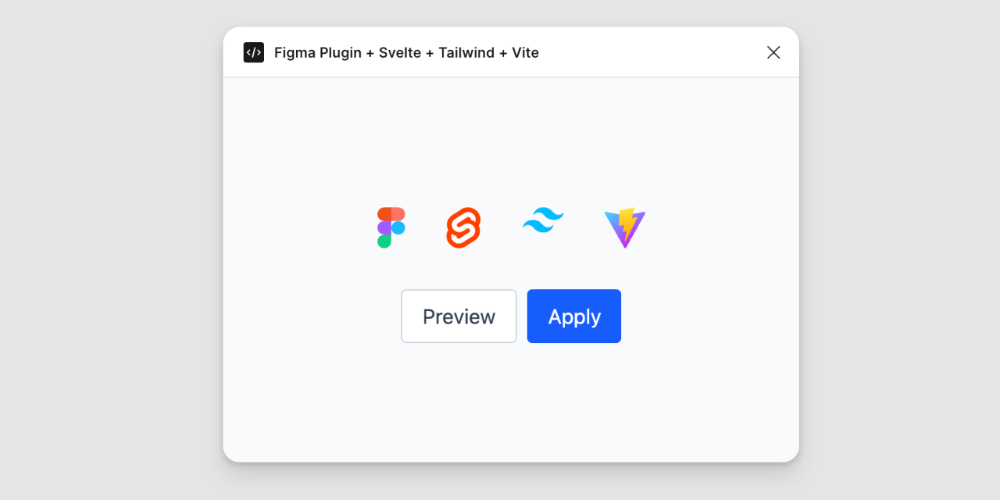

# Figma Plugin + Svelte + Tailwind + Vite + Typescript



A boilerplate for creating Figma plugins using Svelte, Tailwind CSS (v4), Vite, and Typescript.

## Features

- **Svelte 5**: Latest version of Svelte.
- **Tailwind CSS v4**: Utility-first CSS framework with the latest engine.
- **Vite**: Fast build tool and dev server.
- **Hot Reload**: Concurrent development for both Plugin code and UI.
- **TypeScript**: Type safety for both Plugin and UI logic.

## Connecting your plugin to Figma

1. Go to **Plugins > Development > New Plugin** in the Figma desktop app.
2. Choose **"Link existing plugin"**.
3. Select the `manifest.json` file located in the **root** of this project.

## Development

Run the development server which watches both your Plugin code (`src/code.ts`) and UI code (`src/App.svelte`):

```bash
npm run dev
# or
bun run dev
```

- **UI changes**: Vite will rebuild `dist/index.html` automatically. Reopen the plugin in Figma to apply changes.
- **Plugin logic changes**: `esbuild` will rebuild `dist/code.js` automatically.

## Build

To build the plugin for production:

```bash
npm run build
```

This generates the minimized and optimized files in the `dist` folder, ready for publishing.
